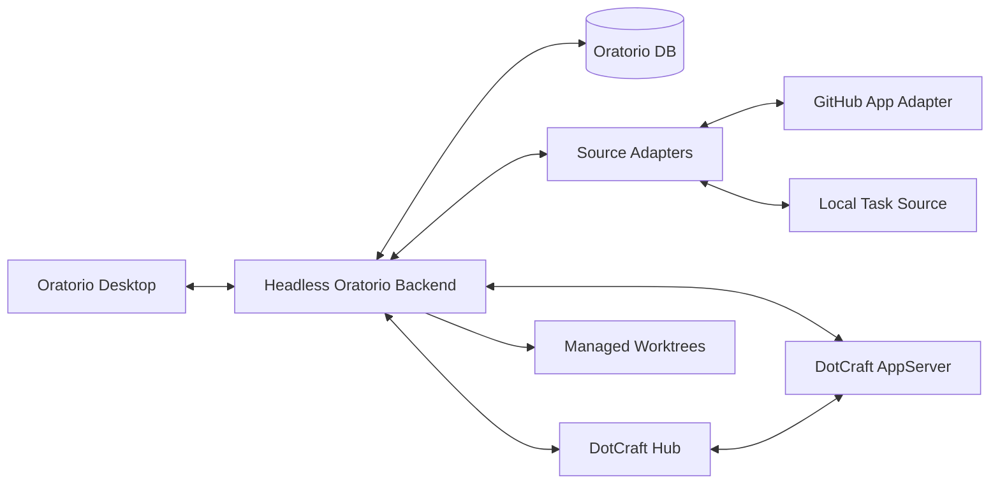
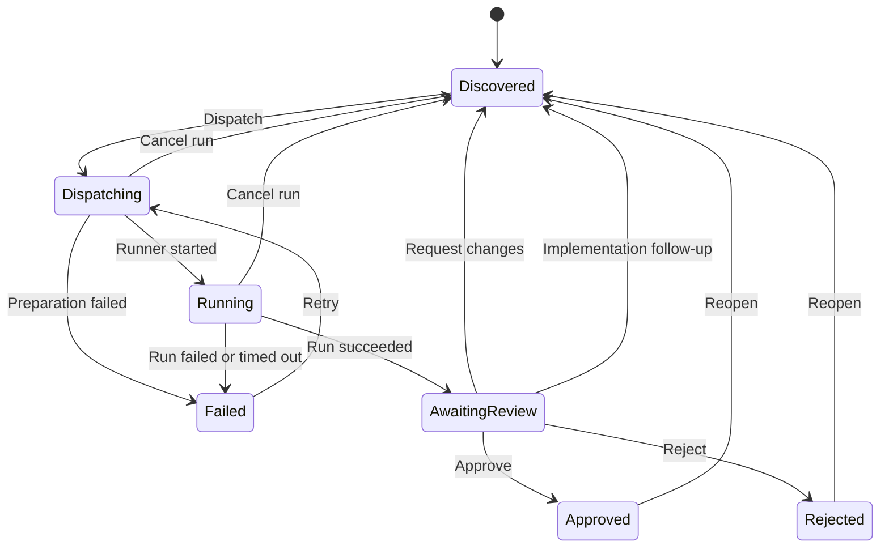

# Oratorio Design Specification


| Field | Value  |
| ----- | ------ |
| Version      | 0.1.0    |
| Status       | Living |
| Date         | 2026-05-05        |
| Parent Specs | [AppServer Protocol](../../dotcraft/specs/appserver-protocol.md), [Automations Lifecycle](../../dotcraft/specs/automations-lifecycle.md), [OpenAI Symphony SPEC](https://github.com/openai/symphony/blob/main/SPEC.md) |
| Companion   | [Oratorio Desktop Frontend](./oratorio-frontend.md) — canonical board-only desktop renderer layout, navigation, and component vocabulary. This document owns product behavior; the frontend spec owns visual and interaction design.                                                                              |


Oratorio is DotCraft's standalone agent project management product. It runs as a
desktop operator UI plus a durable headless backend, owns Task state, comments,
dispatch and review rounds, decisions, run summaries, review drafts, delivery
drafts, and source write audit history, and drives DotCraft through AppServer or
Hub. DotCraft remains the agent runtime and workspace execution layer.

The desktop renderer boundary is intentionally narrow: Oratorio Desktop shows
the board, Task cards, and compact Status drawers. Detailed AppServer
conversation, approval decisions, plan inspection, file/terminal/preview views,
and turn-by-turn interaction belong in DotCraft Desktop.

This document is the canonical product and behavior contract for Oratorio. It
captures enduring boundaries, domain behavior, source semantics, runtime
contracts, and validation expectations without tracking delivery history.

Reference material:

- [OpenAI Symphony SPEC](https://github.com/openai/symphony/blob/main/SPEC.md)
- [Devin Review](https://docs.devin.ai/work-with-devin/devin-review)
- [GitHub: Commenting on a pull request](https://docs.github.com/en/pull-requests/collaborating-with-pull-requests/reviewing-changes-in-pull-requests/commenting-on-a-pull-request)
- [GitHub: Pull request reviews API](https://docs.github.com/en/rest/pulls/reviews?apiVersion=2022-11-28)
- [GitLab: Suggest changes](https://docs.gitlab.com/user/project/merge_requests/reviews/suggestions/)
- [GitLab: Suggestions API](https://docs.gitlab.com/api/suggestions/)
- [parkerbxyz/suggest-changes](https://github.com/parkerbxyz/suggest-changes)
- [GitHub: resolveReviewThread mutation](https://docs.github.com/en/graphql/reference/mutations#resolvereviewthread)
- [GitLab: Resolve a thread (Discussions API)](https://docs.gitlab.com/api/discussions/#resolve-a-merge-request-thread)

---

## 1. Product Boundary

Oratorio is:

- a Project and Task board for assigning, tracking, and reviewing agent work;
- a long-running orchestration backend with durable state;
- a source adapter host for GitHub first and additional trackers later;
- an AppServer/Hub client that dispatches review and work rounds to DotCraft;
- the owner of multi-round operator feedback and review decisions.

Oratorio is not:

- a replacement for DotCraft Session Core, AppServer, or Hub;
- a built-in DotCraft Desktop panel;
- a larger version of built-in Automations;
- a general cron or reminder system;
- the owner of low-level agent execution internals.

DotCraft built-in Automations intentionally has no task-level review gate. Local
task automation, scheduled execution, and built-in source-neutral dispatch stay
there unless a separate design contract explicitly moves behavior into Oratorio.

---

## 2. Architecture Contract



| Component          | Contract                                                                                                                                         |
| ------------------ | ------------------------------------------------------------------------------------------------------------------------------------------------ |
| Oratorio Desktop   | Provides the task board, Status-only drawer, source/run/write summaries, Settings, and operator-visible board actions. It does not host the AppServer conversation client. |
| Headless Backend   | Owns orchestration, durable state, source sync, review transitions, AppServer dispatch, reconciliation, and source writes. It exposes API, health, and realtime stream endpoints, and does not serve a browser UI. |
| Oratorio DB        | Stores items, rounds, runs, comments, decisions, review drafts, source snapshots, timeline events, and source write logs.                        |
| Source Adapters    | Normalize external and local work into Oratorio source items and expose explicit read/write capabilities.                                        |
| GitHub App Adapter | Reads GitHub issues/PRs and writes comments, reviews, check runs, and source write audit entries through installation credentials.               |
| Local Task Source  | Owns Oratorio-local tasks with comments, rounds, dispatch, and review decisions independent of GitHub.                                           |
| AppServer Bridge   | Starts or resumes DotCraft threads, submits turns, subscribes to events, and records final output.                                               |
| Worktree Manager   | Owns backend-managed worktree paths, branch naming, concurrency limits, cleanup, and restart reconciliation.                                     |
| Hub Routing        | Maps source repositories to DotCraft workspaces and resolves AppServer endpoints through Hub when available.                                     |


---

## 3. Lifecycle Contract

Oratorio state names are product states, not built-in Automations states.




Required lifecycle behavior:

- Every dispatch belongs to a durable round.
- Every run belongs to a round and records runner kind, attempt, status,
progress, heartbeat, summary, and error information when available.
- `approve` and `reject` are terminal for the current round until reopened.
- Timeline entries are operator-facing projections; canonical state remains in
items, rounds, runs, comments, decisions, source snapshots, and source write
logs.
- Operator cancellation is available only while an item is `dispatching` or
  `running`. It marks the active run as `cancelled`, closes the current round as
  `cancelled`, clears the current run, and returns the item to `discovered`.
  Cancellation is a run lifecycle action, not a decision, and the next dispatch
  creates the next numbered round.
- `requestChanges` requires non-empty feedback, records a linked operator
comment, closes the current round as `changesRequested`, and returns the item
to `discovered`.
- The next dispatch after requested changes creates the next numbered round.
- `reReview` is available for GitHub pull requests after the pull request head
  SHA changes from the latest successful AppServer review analysis run. It
  records an internal decision, supersedes the current round, creates the next
  numbered round, and queues a new read-only review run without writing to
  GitHub.
- Repository-level Auto Review uses the same round semantics as `reReview`.
  For enabled repositories, new open non-draft pull requests that appear after
  enablement queue an AppServer `reviewAnalysis` run automatically. Later head
  SHA changes supersede the current round and queue the next read-only review
  round after any active run finishes. Auto Review never writes a GitHub
  decision.
- Implementation Follow-up is an automated, gated, bounded loop anchored on the
  originating GitHub/GitLab issue or local task — never on the generated pull
  request, which stays a read-only review target per §5.5 and §6. When an
  originating item that already delivered a generated pull request is in
  `awaitingReview` and that generated PR accrues new unresolved published review
  findings (§5.3) or new human PR review comments, the Implementation Follow-up
  scheduler re-activates the originating item to `discovered`, creates the next
  numbered round, and queues a new implementation run that reuses the existing PR
  branch and pushes follow-up commits to the same pull request (§5.5). The loop
  fires only while the originating item is `awaitingReview`, has no active run, is
  not `approved`/`rejected`/`archived`, the generated PR is still open (not merged
  or closed), and the item's follow-up round count is below the configured
  maximum. The next implementation round after follow-up re-activation is an
  ordinary numbered round.
- Implementation Follow-up terminates when the generated PR has no open findings
  and its latest review round is clean, when the follow-up round cap is reached
  (recorded as an operator-visible skip state), when the operator `approve`s the
  originating item (accepting the handoff), or when the generated PR is merged,
  closed, or archived. Operators can disable the loop globally or per repository
  through the Implementation Follow-up policy in §4.
- `approve` is allowed only after a completed run has moved the item to
  `awaitingReview`.
- For GitHub pull request review rounds, Oratorio writes the `oratorio/review`
  check run as `in_progress` when the round is queued and updates that same
  check run to completed `neutral` when the review run succeeds, returning
  merge ownership to GitHub collaborators. Explicit later Oratorio approval,
  requested changes, rejection, or terminal run failure may update the same
  check run to success, action-required, or failure. This external check is the
  merge gate only when the repository requires it through GitHub branch
  protection or rulesets.
- `archive` is available for non-active local and source-backed items and
  preserves all history; `reopen` restores an archived item to `discovered`.
- Rejected and archived items are closed/history work. They keep the
  compatibility `cancelled` TaskStatus projection but are not part of the
  default Active board.
- Imported source comments are source context, not operator feedback, and must
  not be treated as requested follow-up work by themselves. The one bounded
  exemption is human review comments on the generated pull request of an
  originating implementation item: under the gated Implementation Follow-up loop
  they are actionable follow-up feedback for that originating item's next
  implementation round (§5.5, §6).

---

## 4. Domain and API Contract

Oratorio's backend owns workflow truth. The Desktop renderer renders state
returned by the API and must not invent domain transitions.

Canonical domain records:

- `Item`: source-neutral unit of work with `(source, externalId)` identity,
  optional repository metadata, lifecycle state, current round, current run,
  latest summary, check state, source lifecycle state, archive reason, and
  source sync timestamp.
- `Round`: durable review cycle for one item with a number, status, prompt
  audit context, latest summary, and completion timestamp.
- `Run`: execution attempt inside a round with runner kind, dispatch trigger,
  target head SHA when applicable, attempt, status, thread ID, turn ID,
  AppServer endpoint, prompt audit context, summary, error details, managed
  worktree metadata, retry state, and scheduler lease metadata.
- `Comment`: operator, source, agent, or system feedback attached to an item and
  optionally a round, with a purpose such as feedback, discussion question,
  discussion reply, source context, or system note.
- `DiscussionTurn`: lightweight operator-to-agent question bound to one item,
  optional round, operator question comment, optional agent reply comment, base
  AppServer run, thread ID, turn ID, status, prompt audit context, and error
  information. Discussion Turns are not Runs and do not create Rounds.
- `Decision`: operator action on a round: `approve`, `requestChanges`,
  `reject`, `reopen`, or `reReview`.
- `ReviewDraft` and `ReviewDraftComment`: structured PR review draft data
  submitted by DotCraft and later published, discarded, or left in draft state.
  A published, accepted `ReviewDraftComment` additionally carries resolution
  state (open/resolved, kind, actor, note, provenance, and source-thread
  mapping) per §5.7.
- `SourceWrite`: auditable GitHub write attempt with request, response, status,
  error, retry, and external URL metadata.
- `TimelineEvent`: append-only operator-facing projection for source sync,
  round, run, comment, decision, check, review draft, and write events.
- `AutoReviewRepositoryState` and `AutoReviewItemState`: durable backend
  scheduler state for repository Auto Review enablement, first-enable
  baselines, last observed PR heads, last queued PR heads, and visible skip or
  routing errors.
- `ImplementationFollowUpItemState`: durable backend scheduler state for the
  Implementation Follow-up loop (§3, §5.5), keyed by originating item, with the
  linked generated PR item, the last observed open-finding signature, the last
  observed human PR comment time, last queued head/round/run, the follow-up round
  count, and visible skip or cap state.

Public REST endpoints live under `/api/v1`, use camelCase JSON, and return
stable error objects:

```json
{
  "error": {
    "code": "invalidTransition",
    "message": "Cannot approve an item that is not awaiting review.",
    "details": {}
  }
}
```

Required endpoint groups:

- item list/detail and source-key lookup;
- local task create/update/archive/reopen;
- source-backed item archive/reopen;
- comment, discussion-turn, dispatch, approve, request-changes, reject, and
  reopen actions;
- run detail;
- GitHub status, sync, write retry, and source write visibility;
- review draft detail exposure plus edit, publish, and discard actions, and
  operator resolve/reopen of a published review finding per §5.7;
- DotCraft/AppServer status, workspace inventory, per-workspace health, and
  dispatch diagnostics.
- top-level status capabilities for managed worktrees, concurrency limits, and
  bridge/runtime feature visibility.
- settings diagnostics and server configuration endpoints for redacted
  diagnostics, configuration reads/writes, encrypted secret updates, and change
  audit history.

Mutating endpoints must validate lifecycle transitions at write time. Retrying a
failed source write retries only that write record and never creates a new
operator decision.

Server configuration writes are a local-admin capability, not a general remote
administration API. They require a trusted local boundary or production operator
authentication. Writable fields include selected GitHub source, GitHub credential
presence, DotCraft bridge, workspace routing, managed worktree, concurrency,
retry, timeout, cleanup policy values, implementation auto-dispatch policy,
repository Auto Review allowlists, Draft auto-publish allowlists, and the
Implementation Follow-up policy (global enablement, repository allowlist, and
maximum follow-up rounds). Tokens,
webhook secrets, and private keys are writable only through one-shot
replace/clear semantics and must be stored encrypted. Auto-start commands and
process arguments are never writable through Settings. Writes create a durable
redacted configuration change audit entry and return a restart-required
signature; they do not hot-apply by reloading the configuration root.

---

## 5. Source Contract

### 5.1 GitHub Read Sync

GitHub read sync must normalize:

- issues and pull requests into stable Oratorio source items;
- stable source keys of the form `github` plus an external ID such as
`issue:owner/repo#42` or `pr:owner/repo#184`;
- title, body, repository, assignee, labels, external URL, branch, draft state,
source updated time, and head SHA where applicable;
- issue comments, PR reviews, and PR review comments as source-visible comments;
- source lifecycle state as `open`, `closed`, `merged`, or `unknown`, plus
  source close and merge timestamps when available;
- source snapshots for prompt reconstruction and audit.

GitHub read failures should be visible to operators and must not corrupt
existing imported item history.

Closed issues and closed or merged pull requests should be automatically
archived when no run is active. If a source item reopens and the archive reason
was source-driven, Oratorio should restore it to `discovered`. Manual archive
must not be undone by a later source sync.

Archived source-backed and local tasks are hidden from the Active board by
default. Operators access them through an explicit Archived list view that pages
history results instead of rendering all archived cards in the board.

### 5.2 GitHub Write Feedback

GitHub writes are backend-owned adapter operations, not implicit agent behavior.
Oratorio supports explicit, auditable write actions for:

- Oratorio review summaries;
- request-changes feedback;
- reject or attention-needed feedback;
- GitHub PR review comments, including suggestion blocks;
- `oratorio/review` check-run state;
- source write logs visible in Oratorio.

GitHub writes are enabled only when GitHub write configuration and GitHub App
authentication are available. If writes are disabled or misconfigured, Oratorio
records a failed source write with a stable error code instead of hiding the
problem.

GitHub App installation identity is routed by GitHub instance and repository
owner rather than by one global installation ID. A configured profile maps
`<instance>/<owner>` to one installation ID, and every GitHub read, write,
branch push, and PR creation resolves the target repository through that owner
profile. When a profile is missing, Oratorio may use GitHub App credentials to
discover the repository installation through GitHub's repository installation
API; discovery failures must be reported without blocking unrelated project
routing saves.

Decision write mapping:

| Oratorio item | Operator action | GitHub write |
| --- | --- | --- |
| Pull request | `approve` | PR review plus `oratorio/review` success check |
| Pull request | `requestChanges` | PR review plus action-required check |
| Pull request | `reject` | PR review plus failure check |
| Pull request | `reReview` | no GitHub decision write; the new review round still writes/updates the `oratorio/review` gate check |
| Issue | `approve`, `requestChanges`, or `reject` | Issue comment only |
| Local task | any decision | no GitHub write |

PR review suggestions must be published through GitHub PR review APIs as
operator-visible Oratorio writes. A single GitHub `COMMENT` review may include
one summary body and multiple inline comments. Inline comments should use
GitHub's current diff anchor fields (`path`, `line`, `side`, and optional
`startLine`/`startSide`) rather than relying on deprecated diff positions.
Suggestion replacements are rendered by Oratorio into GitHub suggestion blocks
inside the inline comment body.

GitHub App installation alone must not be treated as a merge gate. Repositories
must explicitly require the Oratorio check through branch protection or rulesets.

Automated Oratorio writes must not silently merge PRs, create commits, push
branches, or approve outside an explicit operator decision. Review draft
publication always creates a GitHub `COMMENT` review and never emits approval,
request-changes, merge, close, or branch-protection decisions by itself. GitHub
`APPROVE` review events are emitted only for explicit Oratorio operator approval
decisions.

Every intended write creates a source write record with item, round, decision or
draft linkage, source, kind, intent, status, repository, source number, head SHA
when applicable, request JSON, response JSON, external ID or URL when available,
attempt count, error code, error message, and timestamps. Timeline entries must
show queued, succeeded, and failed write attempts.

GitHub write failures are audited and retryable through Oratorio source-write
records. They do not roll back recorded Oratorio decisions or item transitions;
check-gated repositories should rely on the `oratorio/review` check-run state as
the external merge gate when GitHub write delivery fails.

### 5.3 Structured PR Review Suggestions

Oratorio must support Devin-like PR review suggestions as a structured draft
flow, not as free-form agent text.

The required ownership boundary is:

- DotCraft agents analyze the PR and submit structured review drafts.
- Oratorio validates, stores, displays, and audits the drafts.
- Operators decide whether to publish, edit, discard, or request another round.
- GitHub writes are performed only by Oratorio through installation
  credentials.

The canonical agent submission contract is a tool named `SubmitReviewDraft`.
For Oratorio-created AppServer runs, Oratorio exposes this contract as a
Runtime Dynamic Tool:

- **Runtime Dynamic Tool**: for Oratorio-created AppServer runs, Oratorio
  declares `SubmitReviewDraft` on `thread/start.dynamicTools`. DotCraft invokes
  it through `item/tool/call`, and the callback is bound to the AppServer
  connection and thread that created the run.

Runtime Dynamic Tools are not plugin manifest native tools. DotCraft plugin
manifests contribute Skills, MCP server declarations, and interface metadata;
model-callable plugin services should use MCP when they are external reusable
services. Dynamic Tools remain the direct thread-scoped callback path for an
AppServer client such as Oratorio.

Every `SubmitReviewDraft` call must bind to the current Oratorio run thread so
that drafts cannot be submitted across unrelated runs. Any external reusable
review service must provide an explicit run or round binding contract before it
can submit drafts.

`SubmitReviewDraft` input must include:

- `summary`: object with review counts and body text;
- `comments`: array of inline review findings.

Each `comments` item must use the same field shape as DotCraft's built-in
GitHub PR review automation where possible:

- `severity`;
- `title`;
- `body`;
- `path`;
- exactly one of:
  - `suggestion`: object with `oldText` and `newText`;
  - `commentOnly`: object with `line`, `side`, optional `startLine` /
    `startSide`, and `reason`.

Each inline comment must be either a concrete code suggestion or a
comment-only finding:

- concrete code suggestions must provide `suggestion.oldText`, the exact
  current right-side diff text to replace, and `suggestion.newText`, the exact
  replacement body to render as a native GitHub/GitLab suggested change.
  Oratorio resolves `oldText` against the provider diff and derives
  `line`/`startLine` for publication;
- comment-only findings must omit `suggestion` and provide
  `commentOnly.reason` as one of `needsHumanDecision`,
  `requiresLargerChange`, `cannotAnchorSafely`, `investigateOnly`, or
  `leftSideOrDeletion`.

Review Draft copy requirements:

- default review prose is restrained English engineering copy with no
  greetings, filler, raw JSON, or repeated machine-readable draft payload in
  the final response;
- clean reviews must use `summary.body` exactly `No issues found.`, set
  `majorCount`, `minorCount`, and `suggestionCount` to `0`, and submit
  `comments: []`;
- reviews with accepted findings use a minimal summary body, `Found N issue.`
  or `Found N issues.`; details belong in inline comments, not in the review
  summary;
- Oratorio canonicalizes agent-submitted `summary.body`, `majorCount`, and
  `minorCount` from accepted comments when the draft is submitted; operator
  edits made afterward are respected when publishing;
- inline finding `title` values are concise imperative or problem statements;
- inline finding `body` values use natural reviewer prose that explains the
  failure mode and why it matters, with a short suggested direction when useful;
- published inline comment titles are prefixed with `🔴` for `RED` findings and
  `🟡` for `YELLOW` findings; stored draft titles remain unprefixed;
- `suggestion.oldText`/`suggestion.newText` is used only for exact, small,
  right-side code changes that can be safely published as native suggestions;
- `commentOnly.reason` is used for investigation-only findings, larger
  refactors, unsafe anchors, human decisions, and left-side or deletion notes;
- `RED` means a likely bug affecting correctness, security, data loss, or a
  broken workflow; `YELLOW` means an investigation flag, maintainability risk,
  or lower-confidence issue;
- informational explanations stay in `summary.body` or are omitted. They must
  not become noisy FYI inline comments.

`summary.suggestionCount` means accepted concrete code suggestions only. The
server derives and persists this value from accepted inline comments with
resolved `suggestion.oldText`/`suggestion.newText`; if the agent-submitted
count differs, Oratorio stores the derived value and records a warning.

Successful `SubmitReviewDraft` output must include:

- `draftId`;
- accepted comment count;
- warnings for skipped anchors that the agent cannot repair in the current
  round, such as unavailable provider diff data.

Correctable agent anchor errors, including paths outside the diff,
non-commentable comment-only line or range anchors, or side mismatches, must
fail the dynamic tool with `reviewDraftAnchorNotCommentable`. Suggestion
`oldText` that is absent from the right-side diff must fail with
`reviewDraftSuggestionTextNotFound`; `oldText` that matches multiple right-side
diff ranges must fail with `reviewDraftSuggestionTextAmbiguous`. Failed results
must include enough metadata and available commentable ranges for the agent to
repair the draft and call `SubmitReviewDraft` again in the same DotCraft round.
Invalid items must not cause Oratorio to publish a partial GitHub review
silently.

Validation requirements:

- summary body is required;
- paths must be repository-relative and must not contain traversal;
- code suggestions must provide non-empty `suggestion.oldText` and present
  `suggestion.newText`; missing values return `reviewDraftSuggestionRequired`;
- `suggestion.oldText` must match exactly one contiguous right-side
  changed/context diff range after line-ending normalization;
- comment-only `line` and `startLine` must be positive when present;
- comment-only `startLine` must be less than or equal to `line`;
- comment-only `side` and `startSide` must be `RIGHT` or `LEFT`;
- inline comments must provide exactly one of `suggestion` or `commentOnly`;
  otherwise the dynamic tool returns the stable
  validation error `reviewDraftSuggestionRequired`;
- legacy top-level `line`, `startLine`, `side`, `startSide`,
  `suggestionReplacement`, or `commentOnlyReason` fields are rejected for new
  submissions with `reviewDraftLegacySuggestionFields`;
- no-op replacements whose `suggestion.newText` exactly matches
  `suggestion.oldText` should be skipped with a
  `reviewDraftNoOpSuggestion` warning;
- changed file and diff anchor validation must fail correctable invalid agent
  anchors with `reviewDraftAnchorNotCommentable` and must not persist a draft
  for that tool call;
- summary-only drafts with `comments: []` must not require source diff reads;
- unavailable source diff data or provider/file patch omissions must preserve
  submitted inline comments as skipped warnings instead of failing the dynamic
  tool call.

Draft lifecycle:

- `draft`: editable and publishable;
- `published`: immutable after GitHub publication succeeds;
- `discarded`: intentionally ignored by the operator;
- `publishFailed`: retryable after a failed publish attempt.

Every GitHub pull request and GitLab merge request AppServer `reviewAnalysis`
run must call `SubmitReviewDraft` before it can succeed. If the agent finds no
actionable issues, it must submit a summary-only draft with `majorCount`,
`minorCount`, and `suggestionCount` all `0`, summary body `No issues found.`,
and `comments: []`. A GitHub PR or GitLab MR review run that completes without any
Review Draft fails with the stable error code `reviewDraftRequired`; Oratorio
must not synthesize the draft on the agent's behalf.

Review Draft publication may be manual or automatic by Draft auto-publish
policy. Draft auto-publish is globally gated and repository opt-in by exact
`owner/name`. It must publish only a GitHub `COMMENT` review, never `APPROVE`,
`REQUEST_CHANGES`, merge, close, issue-close, or branch-protection decision
events. Draft auto-publish does not resolve the Oratorio item; the item remains
`AwaitingReview` until an operator records an Oratorio decision. Draft warnings,
skipped inline comments, stale head SHA, missing GitHub write authentication, or
disabled GitHub writes block auto-publication and create failed source-write
records tied to the draft.

GitHub publication uses a single `COMMENT` pull request review with the summary
body plus accepted inline comments. Only concrete code suggestions render a
fenced `suggestion` block; comment-only findings publish as prose comments.
GitLab publication creates a summary note plus inline discussions. Multi-line
GitLab code suggestions render offset-aware fence openings such as
`suggestion:-N+M` when the final anchor line needs to cover preceding lines.
The Review Draft UI must show code-suggestion and comment-only finding counts
separately and display the `commentOnlyReason` for comment-only findings.

Settings presents Draft auto-publish as a repository allowlist card over
configured GitHub repositories. The `Manage` dialog updates the Settings draft
allowlist; at least one selected repository writes
`Automation.AutoReviewPublishEnabled=true` with the selected repository
allowlist, while an empty allowlist writes disabled with an empty allowlist.
Selected repositories can also be removed directly from the allowlist card.

Repository-level Auto Review is separate from Draft auto-publish. Its server
configuration key is `Automation.AutoReviewRepositories`, exposed as
`automation.autoReviewRepositories` in the Settings API. Each entry is an exact
`owner/name`. A configured GitHub repository has two v1 states: `Off` and
`Auto review`; label-based PR review triggers are not part of the Auto Review
contract and must not affect Issues implementation auto-dispatch policy.
Settings manages this repository allowlist with the same card and searchable
checkbox dialog pattern as Draft auto-publish.

Settings manages implementation auto-dispatch allow and block label lists as
free-form label controls rather than multiline text. Labels are trimmed, empty
entries are ignored, and duplicates are removed case-insensitively while
preserving the first entered spelling. An empty allow list continues to mean
all otherwise eligible, unblocked GitHub Issues and local tasks may dispatch.

Auto Review scheduler requirements:

- when a repository is first enabled or re-enabled, baseline current open
  non-draft PRs and do not queue historical reviews;
- after enablement, a new open non-draft PR queues an AppServer
  `reviewAnalysis` run;
- after enablement, each observed PR head SHA change queues one new review
  round for the latest head;
- auto re-review must match manual `reReview`: supersede the current round,
  create the next round, queue a read-only AppServer review run, and perform no
  GitHub decision write beyond the review-gate check state;
- skip draft, closed, merged, archived, rejected, active-run, non-PR, non-GitHub
  and missing-workspace-route items, and record operator-visible skip or error
  state;
- if a new head appears while a review run is active, record the latest
  observed head and queue exactly one follow-up round for that latest head after
  the active run completes.

Comment lifecycle:

- `accepted`: valid inline comment eligible for publication;
- `skipped`: stored for audit and warning display, but not sent to GitHub.

An accepted comment that has been published additionally carries a resolution
state per §5.7. Publication status and resolution state are independent: only
published, accepted comments are resolvable, and resolution never edits the
published comment body.

Oratorio uses Runtime Dynamic Tools for direct client orchestration because
Review Draft submission is connection-bound and thread-scoped. Plugin-bundled
MCP remains appropriate for external reusable review services that are not
submitting back into a specific Oratorio run.

### 5.4 Local Tasks

Oratorio-local tasks are first-class Oratorio records. They are separate from
DotCraft built-in Automations local tasks.

Local task behavior must include:

- operator-created title and body;
- optional repository, branch, labels, and workspace metadata;
- comments, review rounds, decisions, and timeline history;
- dispatch through mock runner or DotCraft AppServer;
- approve, request-changes, reject, and reopen transitions;
- edit, archive, and reopen actions only when the task is not actively
  dispatching or running.

Local task identity:

```text
source = local
kind = localTask
externalId = task:{shortId}
```

The backend generates the local task external ID. The UI must not derive
identity from the title because titles are editable. Default task lists hide
archived local tasks unless an explicit archived filter is selected.

Local tasks may participate in implementation auto-dispatch policy for
implementation work. They are still not a general cron/reminder system.

### 5.5 Implementation and Follow-up Drafts

Implementation mode is available for GitHub issues and Oratorio local tasks.
Existing GitHub pull requests remain review targets and are not mutated by
implementation runs.

Implementation runs expose an Oratorio-owned Runtime Dynamic Tool named
`SubmitImplementationDraft`. The tool is bound to the current run and thread in
the same way as `SubmitReviewDraft`; final agent summaries are not sufficient to
create commits or pull requests. A valid draft includes a concise summary,
validation notes, risks, changed files, proposed commit message, proposed PR
title, and proposed PR body.

Agents may modify only the Oratorio-managed execution worktree selected for the
run. Agents must not commit, push, create pull requests, write GitHub issues,
publish reviews, approve, request changes, close issues, or merge. Oratorio
performs delivery actions through its backend and GitHub App credentials.

Delivery policy values are:

- `manualDelivery`: keep the Implementation Draft for explicit operator
  delivery;
- `autoPr`: after validation, commit locally, push a branch through the GitHub
  App installation token, create a pull request through the GitHub API, upsert
  the generated PR as a source item, and link it to the originating issue or
  local task.

Approving an originating implementation item is blocked while it has an
undelivered Implementation Draft. After generated PR delivery, approving the
originating item means the operator accepts the handoff to the generated PR
review flow; it does not approve or merge the generated PR.

Implementation auto-dispatch is controlled separately from delivery policy.
`autoDispatch` decides whether the backend scheduler may start eligible
implementation runs. `deliveryPolicy` decides whether a valid draft waits for
manual delivery or uses `autoPr`. Allow/block labels and repository/workspace
configuration determine eligibility.

Implementation follow-up delivery handles the case where an originating item that
already delivered a generated pull request is implemented again under the
Implementation Follow-up loop (§3). It is delivery of additional commits to the
existing review target, not creation of a new one:

- Before creating a review target, delivery must detect an existing open
  generated pull request for the originating item (by parent linkage and head
  branch). When one exists, delivery pushes follow-up commits to the same branch
  and updates the same generated PR item; it must not open a second pull request.
  If the source API rejects a duplicate creation because the PR already exists,
  delivery resolves and links the existing pull request instead of failing.
- After a follow-up push, delivery updates the generated PR item head so that
  Auto Review or `reReview` (§3, §5.3) detects the new head and re-reviews it.
- The follow-up implementation round's managed worktree is prepared from the
  existing generated PR branch head, not reset to the repository base ref, so
  previously delivered commits are retained and new commits stack on top. This is
  the narrow exception to the per-round worktree base-ref reset in §6.

`autoFollowUp` is a third policy, independent of `autoDispatch` and
`deliveryPolicy`. It decides whether the backend may automatically re-implement an
originating item in response to its generated pull request's review feedback. It
is globally gated and repository opt-in by exact `owner/name`, mirroring Auto
Review and Draft auto-publish. With `autoFollowUp` disabled or the repository not
allow-listed, generated PR feedback never auto-re-activates the originating item.

The Implementation Follow-up loop (§3) is distinct from `SubmitFollowUpDraft`
below: the loop continues the current item's own delivery on its existing PR,
while `SubmitFollowUpDraft` proposes separately scoped new work.

Follow-up runs expose an Oratorio-owned Runtime Dynamic Tool named
`SubmitFollowUpDraft` when eligible. Agents use it to propose split-out work,
blockers, or separately scoped improvements without directly creating external
issues or mutating source trackers.

Follow-up Drafts are bound to the current item, round, run, and AppServer thread.
Operators can edit, discard, or create each draft as an Oratorio local task while
it remains in `draft` status. Creating a local task copies the operator-reviewed
fields into a new local task, marks the draft `created`, records the created item
ID, and adds timeline entries on both the originating item and created task.
When the originating item is a GitHub PR or GitLab MR and the draft does not
explicitly override routing, the created local task inherits the review target's
repository, head branch, and head SHA so later implementation runs start from
the reviewed head rather than the mapped workspace's current `HEAD`.
Follow-up Drafts are advisory and do not become hidden requirements for the
current round.

### 5.6 Agent Discussion Turns

Oratorio supports a narrow, lightweight operator question flow for completed
AppServer work. This flow exists so operators can ask the agent questions from
the Task detail Discussion without re-dispatching a full review or
implementation round.

The required ownership boundary is:

- `Add comment` creates internal operator feedback for record keeping and later
  review rounds.
- `Ask agent` creates an internal operator discussion question and a
  `DiscussionTurn`.
- A pull request `reReview` action is the explicit way to dispatch a fresh
  review after new commits. `Add comment` plus `Ask agent` must not implicitly
  create a re-review round.
- Discussion Turns never create a `Round` or `Run`, never change Task lifecycle
  state, never update `currentRunId`, and never change check state. A Discussion
  Turn writes to a source system only to resolve a review finding under §5.7;
  it must perform no other source write.
- Operator questions and agent replies are rendered in the same Discussion
  history as comments, but their purpose keeps them out of next-round feedback
  by default.

Ask agent eligibility:

- The Task must not be archived, dispatching, or running.
- The Task must have a latest compatible successful AppServer run with a
  reusable thread whose prompt context used compact prompt mode and whose
  dynamic tool list includes `oratorio.SubmitDiscussionReply`.
- The Task must not already have a pending or running Discussion Turn.
- If no compatible thread exists, Oratorio rejects Ask agent with a stable
  validation error instead of implicitly dispatching a new round.

The canonical agent reply contract is a Runtime Dynamic Tool named
`SubmitDiscussionReply`. Oratorio declares this tool on every new
Oratorio-created AppServer thread from `thread/start.dynamicTools` so the tool
set remains prompt-cache friendly across later turns. The tool input is:

- `discussionTurnId`: the pending Discussion Turn to answer;
- `body`: the Markdown reply to record.

`SubmitDiscussionReply` succeeds only when the call is bound to the current
thread and turn for a pending or running Discussion Turn. Mismatched thread,
mismatched turn, unknown turn, completed turn, and empty reply calls must fail
with stable errors. On success, Oratorio records one agent comment with purpose
`discussionReply`, links it from the Discussion Turn, marks the Discussion Turn
succeeded, and publishes a board update so the detail page refreshes.

Discussion Turn prompts must be short and incremental. They should identify the
Task, include the operator's question and `discussionTurnId`, mention the most
recent run summary when available, and point the agent to the stable Oratorio
discussion runtime context for reply submission and boundaries. They must not
restate full source snapshots, full round history, imported source comment
history, or stable tool-use rules.
When the Task has open published review findings, the prompt may additionally
list them per §5.7 so the agent can resolve a finding the discussion concludes
is handled. Discussion Turns require both Dynamic Tool rebind and runtime
additional context support.

### 5.7 Review Finding Resolution

A published review finding (§5.3) is a standing thread that stays open until it
is addressed. Oratorio gives both agents and operators a way to close a finding
without re-running a full review, mirroring GitHub review-thread resolution and
GitLab thread resolution. Resolution serves two flows:

- in an Agent Discussion Turn (§5.6), once discussion concludes a finding is a
  non-issue or already handled;
- in a later review round, once the agent confirms an earlier round's finding was
  fixed at the current head.

Oratorio owns resolution as durable state on the finding and, when the finding
maps to a known source review thread, propagates it to the source system through
installation credentials. Source resolution is never the source of truth;
Oratorio's stored resolution state is.

Resolution model. Each published, accepted `ReviewDraftComment` carries:

- `resolutionState`: `open` or `resolved`, defaulting to `open`;
- `resolutionKind`, required when resolving: `fixed` means the underlying issue
  was addressed in code, typically detected in a later round; `dismissed` means
  the finding was agreed to be a non-issue or intentionally not actioned,
  typically concluded in discussion;
- `resolvedByKind`: `agent` or `operator`;
- `resolutionNote`: optional short rationale;
- `resolvedAt`;
- resolution provenance: `resolvedInRunId` for review-round resolutions,
  `resolvedViaDiscussionTurnId` for discussion resolutions, neither for operator
  resolutions;
- source-thread mapping: `remoteThreadId` and `remoteResolveWriteId` per the
  source propagation rules below.

Resolution rules:

- only an accepted comment in a `published` draft is resolvable; `skipped` and
  unpublished comments are never resolvable because they were never posted;
- resolving is idempotent: resolving an already-resolved finding with the same
  kind is a success no-op; changing the kind updates the stored kind, actor, and
  note;
- operators may reopen a finding (`resolved` to `open`), which clears the
  resolution fields and, when applicable, enqueues a source un-resolve;
- open-finding tallies exclude resolved findings; resolved findings remain stored
  and visible for audit.

Agent contract. The canonical agent contract is a Runtime Dynamic Tool named
`ResolveReviewFinding`, declared on every Oratorio-created AppServer thread
alongside `SubmitDiscussionReply` so both the originating review run and later
Discussion Turns on the same thread can call it, and so the thread tool set stays
prompt-cache friendly. Its input is:

- `findingId`: the published `ReviewDraftComment` to resolve;
- `resolutionKind`: `fixed` or `dismissed`;
- `note`: optional rationale.

`ResolveReviewFinding` succeeds only when the call is bound to the current thread
and the finding belongs to the same Item as the calling run or Discussion Turn.
Mismatched thread, cross-Item findings, unknown findings, and non-resolvable
findings must fail with stable errors (`reviewFindingNotFound`,
`reviewFindingNotResolvable`). On success it records the resolution with
`resolvedByKind` `agent`, sets the matching provenance, appends a timeline event,
publishes a board update, and returns the `findingId` and resulting
`resolutionState`. Resolving a finding is the only source-affecting state change
an Agent Discussion Turn may make.

Prompt requirements:

- a review-round prompt for a PR/MR with earlier rounds lists the prior published
  rounds' still-open accepted findings with their `findingId` values, and
  instructs the agent to resolve with kind `fixed` only those addressed at the
  current head and to leave still-present findings open;
- a Discussion Turn prompt with open published findings lists them with their
  `findingId` values, and instructs the agent it may resolve with kind
  `dismissed` only when the discussion concludes a finding is a non-issue or
  already handled, and must otherwise only reply; resolution must never be used
  to avoid answering the question.

Source propagation. Resolution propagates to the source review thread only when
Oratorio knows the finding's source thread identity. To map findings to threads,
each accepted inline comment published under §5.3 carries a stable hidden marker
referencing its `findingId`. During publish reconciliation Oratorio records
`remoteThreadId` per finding:

- GitHub: each published `COMMENT` review inline comment maps to a pull request
  review thread; Oratorio records the GraphQL review-thread node id per finding;
- GitLab: each inline discussion created during publication maps to one finding;
  Oratorio records the discussion id per finding.

When a finding becomes resolved and a `remoteThreadId` exists, Oratorio enqueues
a `SourceWrite` of canonical kind `resolveReviewThread` that resolves the thread
through the same source-write audit and retry machinery as other writes:

- GitHub resolves with the `resolveReviewThread` GraphQL mutation and un-resolves
  with `unresolveReviewThread`;
- GitLab resolves the discussion with `resolved=true` and un-resolves with
  `resolved=false`.

Source resolution requirements:

- it only toggles the thread resolved flag and never changes review decision,
  approval, merge, close, or branch-protection state;
- it operates only on PRs/MRs Oratorio published to; if no `remoteThreadId` is
  known — for example a draft published before mapping existed, or a comment that
  was `skipped` — resolution stays internal-only and records an operator-visible
  note that the source thread was not resolved;
- a failed `resolveReviewThread` write retries only that write record per §4 and
  never alters the stored resolution state;
- propagation follows the same provider write controls as other source writes;
  disabled writes or invalid credentials record a failed source write rather than
  silently keeping the resolution internal-only.

---

## 6. AppServer, Hub, and Prompt Contract

Oratorio uses DotCraft AppServer as the runtime boundary.

Required AppServer interactions:

- initialize a connection;
- resolve a workspace AppServer endpoint through Hub when available and fall
  back to explicit configuration when Hub cannot provide one;
- start a new thread or reuse a compatible existing thread for an item;
- declare Oratorio-owned Runtime Dynamic Tools through `thread/start.dynamicTools`
  when a round requires thread-scoped callbacks such as PR review drafts,
  implementation drafts, follow-up drafts, or discussion replies;
- declare Oratorio-owned, versioned, thread-stable runtime guidance through
  `thread/start.additionalContext` and rebind the same guidance through
  `thread/resume.additionalContext` for reused threads;
- for accepted App Binding board-tool grants, attach the tools and upsert a
  model-visible App Context Block that tells DotCraft to search/load Oratorio
  board tools before answering board or task-management requests;
- attach per-thread or plugin-bundled MCP tools through `mcpServers` only when a
  round uses external reusable services that are not submitting back into
  a specific Oratorio run;
- submit the rendered prompt as a turn;
- subscribe to thread and turn events;
- map turn completion, failure, cancellation, timeout, and disconnection into
  Oratorio run status;
- record thread ID, turn ID, prompt context, summary, and error details.

Prompt context for real AppServer rounds must include:

- current source item snapshot;
- current round and attempt metadata;
- operator dispatch note;
- imported source comments;
- Oratorio operator comments;
- prior run summaries and errors;
- workspace, repository, branch, and head SHA metadata when available.

For an implementation run on an originating item that has a linked generated pull
request (the Implementation Follow-up loop, §3, §5.5), the per-turn prompt's
feedback section must additionally include the generated PR's still-open published
review findings — `findingId`, severity, title, path, line, and the
`suggestionReplacement` text for concrete code suggestions — together with the
human PR review comments added since the previous follow-up round. The prompt
instructs the agent to address them on the existing PR branch. The implementation
agent does not resolve findings itself: finding resolution stays bound to the
generated PR per §5.7, so the follow-up push changes the PR head and the
subsequent PR review round resolves the findings it confirms fixed. This is the
only place where one item's prompt references another item's review
state, and it is bounded to the originating-item → generated-PR parent link. Only
findings from a published review draft participate; unpublished drafts do not
trigger or feed the loop. This per-run, cross-item feedback stays in the user-turn
request, never in thread-stable runtime additional context.

The stored `PromptContextJson` is audit data and may contain full structured
context. The Dashboard-visible prompt should be compact prose with sections
such as:

- `Review target`;
- `Source description`;
- `New operator feedback`;
- `Current task`;
- `Available tools`.

The agent-facing prompt must not include a full serialized `Context JSON:`
section, full round history, full source snapshot payload, full imported comment
history, or all prior summaries unless a specific product change intentionally
changes the prompt contract. Stable Oratorio run rules, source-write boundaries,
Review Draft formatting rules, implementation draft submission rules, follow-up
draft submission rules, and Discussion Turn tool-use rules belong in runtime
additional context rather than in each turn's user request. Runtime additional
context is thread-lifecycle context: it must be stable for the thread and must
not include per-run or per-turn facts such as concrete discussion turn IDs,
operator questions, open finding state, source head SHAs, or whether a specific
review diff snapshot is currently available. If the AppServer does not advertise
`runtimeAdditionalContext`, Oratorio-created runs must fail with
`runtimeAdditionalContextUnsupported` instead of falling back to prompt
injection.

Thread reuse contract:

- Oratorio may reuse the latest successful AppServer run thread for the same
  item when the previous run used compact prompt mode, the workspace path is the
  same, and required Dynamic Tools match exactly.
- If no compatible thread is found, Oratorio creates a new compact-prompt
  thread and records the reason in the timeline.
- Reused threads still create a new turn and a new Oratorio run.
- New threads receive full compact context. Reused threads receive only the
  incremental user request, new operator feedback, source deltas, and required
  metadata needed for the next turn; they must not repeat the full compact
  prompt that was already injected into the thread.
- Re-review runs caused by a changed pull request head use ordinary review run
  prompts. When a compatible thread is reused, the incremental operator input
  must state the old and new head SHAs and ask the agent to re-review the latest
  head while focusing on new changes when useful.
- Before starting a turn on a reused thread, Oratorio resumes the AppServer
  thread with the current run's Dynamic Tools and the same versioned Oratorio
  runtime additional context used for the thread lifecycle. If the server cannot
  rebind tools, Oratorio creates a fresh thread instead of reusing a stale
  callback binding. If the server cannot accept runtime additional context,
  Oratorio fails the run. Threads whose stored prompt context has an older
  runtime context version are not eligible for reuse.
- Tool calls remain bound to the current run, round, connection, and thread.
  Stale or mismatched calls must fail with a stable error.
- `oratorio.SubmitDiscussionReply` is declared on every new Oratorio-created
  AppServer thread, but it is accepted only for the currently bound
  Discussion Turn thread and turn. Calls made during ordinary review or
  implementation runs without a pending Discussion Turn must fail with a stable
  error.
- Hub is used for AppServer endpoint discovery, not as a message relay or
  security boundary. Oratorio resolves a configured repository workspace path,
  asks Hub for the workspace's AppServer endpoint, then connects directly to that
  AppServer.
- Repository workspace routing must support a single configured workspace and
  explicit `owner/name` to absolute workspace path mappings. There is no
  implicit fallback workspace route.
- When Hub is unavailable, an explicit AppServer endpoint may be used for mapped
  workspaces; it does not imply a fallback workspace path. If no endpoint can be
  resolved for a mapped workspace, status surfaces and runs must report the
  stable reason `workspaceNotRegisteredInHub`.

Managed worktree and concurrency contract:

- AppServer runs use Oratorio-managed Git worktrees by default. Mock runs do
  not require a worktree.
- Hub and AppServer endpoint discovery use the mapped repository checkout. The
  DotCraft thread execution workspace uses the managed worktree path.
- If the base checkout is missing or is not a Git repository, preparation fails
  clearly and Oratorio must not silently dispatch against a shared workspace.
- Worktree identity is deterministic per work item so repeated rounds can reuse
  the same isolated workspace when it is clean and valid.
- Worktrees live under the configured Oratorio-managed root. By default this is
  `<repositoryWorkspace>/.craft/oratorio/worktrees`.
- Reuse must validate the existing worktree. Dirty or invalid worktrees fail
  preparation with operator-visible errors instead of destructive cleanup.
- Each run records the base workspace path, worktree path, worktree branch,
  requested base ref, resolved base SHA, worktree status, error details, retry
  count, next retry time, lease owner, and lease acquisition time.
- `WorktreeStatus` values are `NotRequired`, `Preparing`, `Ready`,
  `CleanupPending`, `Cleaned`, and `Failed`.
- AppServer scheduling uses explicit leases and configurable capacity limits at
  global, repository, and source levels.
- AppServer runs interrupted by backend restart are reconciled as failed or
  retried according to the retry policy. Stale heartbeats trigger stalled-run
  handling.
- Transient preparation, AppServer, timeout, disconnection, and stalled-run
  failures may schedule bounded retries with exponential backoff capped at five
  minutes.
- Successful managed worktrees are retained briefly for inspection and then
  cleaned. Failed or timed-out worktrees are retained longer for debugging.
  Cleanup is allowed only for persisted Oratorio-managed paths under the
  configured root.

Review analysis runs must preserve the read-only safety posture: no GitHub
writes by the agent, no merges, no branch or commit creation, no pull requests,
and no workspace file mutation. Implementation runs are the narrow exception:
the agent may modify only the selected Oratorio-managed execution worktree, and
Oratorio remains responsible for commit, push, pull request creation, and source
write audit.

When PR review suggestion drafting is enabled, prompts must instruct the agent
to call the available `SubmitReviewDraft` tool instead of embedding
machine-readable review JSON in the final answer. GitHub PR and GitLab MR
review runs must always call the tool, including clean reviews with zero inline
comments. Inline findings must target commentable changed/context lines from
the PR/MR diff rather than arbitrary full-file line numbers. If
`SubmitReviewDraft` fails with `reviewDraftAnchorNotCommentable`, the prompt
must require the agent to choose from the returned ranges and call the tool
again before completing the turn. Final summaries should describe what was
submitted and any warnings that remain, while the tool call remains the
canonical structured delivery channel.

---

## 7. Desktop Renderer Behavior Contract

The Desktop renderer is Oratorio's operator surface for the domain and API
capabilities defined in this document. It must make the queue, source identity,
round history, run status, review decisions, source writes, review drafts,
local tasks, source status, and settings visibility accessible to operators.

Core renderer behavior:

- The board uses one vocabulary for columns, cards, filters, empty states, drag
  feedback, and undo feedback.
- The Active board renders only active columns; cancelled and archived work is
  reached through explicit list views with paged loading.
- The Status Drawer uses compact sections for task metadata, latest run state,
  source metadata, artifact counts, and board-safe actions.
- The board header keeps the Oratorio logo visible and exposes Settings as the
  only non-board navigation entry.
- Hover, pressed, focus, selected, busy, success, disabled, validation, and error
  states must be visible in both light and dark themes.
- Oratorio uses its DotCraft-aligned frontend vocabulary. Other design systems
  may inform individual interaction choices, but they are not the primary design
  system.

Visual layout, navigation information architecture, shell modes, component
primitives, theming, density, responsiveness, and frontend acceptance criteria
are owned by [`oratorio-frontend.md`](./oratorio-frontend.md).

This document owns product transitions, lifecycle states, API validation,
source/write semantics, prompt and AppServer behavior, audit records, and
capability boundaries. The renderer must not invent product transitions,
lifecycle states, domain fields, or validation rules that are not defined in
the contracts above.

---

## 8. Operations and Validation

Operational requirements:

- Self-hosted Oratorio deployments require operator authentication, encrypted
  secret handling for GitHub App and AppServer credentials, health checks, logs,
  migrations, backup and restore guidance, and a documented single-node
  operating model.
- Enterprise SSO, hosted SaaS assumptions, and broad deployment administration
  UX are out of scope unless a separate product contract selects them.

Validation expectations:

- Domain, lifecycle, prompt, and write contract changes require API integration
  tests for state transitions and persisted audit data.
- Agent Discussion Turn tests must cover Ask agent eligibility, comment purpose
  persistence and backfill, single active Discussion Turn per Task, no Task
  lifecycle mutation, `SubmitDiscussionReply` success, and mismatched
  thread/turn/repeat-call failures.
- Prompt tests must verify that new AppServer threads receive full compact
  context, reused dispatch turns receive incremental context, and Discussion
  Turn questions and replies do not become next-round feedback by default.
- GitHub write changes require fake GitHub adapter tests before real credential
  testing.
- Structured PR review suggestions must be developed test-first:
  `SubmitReviewDraft` contract tests first, GitHub review payload tests second,
  and run-level AppServer Dynamic Tool integration tests third.
- `SubmitReviewDraft` contract tests must cover valid drafts, multiple inline
  suggestions, comment-only findings, invalid paths, invalid comment-only line
  or side values, missing summaries, missing `suggestion`/`commentOnly` pairs,
  legacy top-level suggestion fields, missing and ambiguous `suggestion.oldText`,
  no-op replacements, summary-only drafts that do not read diffs, and
  server-derived `suggestionCount`.
- GitHub payload tests must cover one review with multiple comments, suggestion
  block rendering, comment-only prose comments, server-derived
  `suggestionCount`, and summary-only reviews when there are no inline comments.
- GitLab payload tests must cover single-line suggestion fences, multi-line
  offset-aware suggestion fences, diff-unavailable skip warnings, and
  comment-only findings.
- Renderer tests must cover code-suggestion previews, comment-only badges with
  reasons, and warning display.
- Repository Auto Review tests must cover first-enable baselines, new PR
  dispatch, head-SHA re-review, active-run catch-up, ineligible item skips, and
  separation from Draft auto-publish.
- GitHub PR and GitLab MR review run tests must fail runs with
  `reviewDraftRequired` when no `SubmitReviewDraft` call occurs and must accept
  summary-only drafts with empty `comments`, including when source diff reads
  are unavailable.
- Implementation handoff changes require integration coverage for
  `SubmitImplementationDraft` binding, implementation-mode prompt constraints,
  scheduler eligibility and blocker labels, continuation turn limits, manual
  delivery blocking, auto PR delivery, generated PR item linkage, and failure
  transitions for missing drafts, empty diffs, template errors, push failures,
  and PR creation failures.
- Implementation Follow-up loop changes require integration coverage for:
  re-activation of the originating item when its generated PR gains a new open
  published finding or a new human PR review comment; no re-activation from
  already-resolved findings, an unpublished draft, an active run, a terminal
  item, a merged/closed PR, or a disabled/not-allow-listed repository; follow-up
  delivery that pushes to the existing PR branch and updates the same generated PR
  without opening a second pull request (including the duplicate-create defense);
  follow-up worktree preparation that stacks on the existing PR head and retains
  prior commits; prompt feedback that includes the generated PR's open findings,
  their `suggestionReplacement` text, and the new human PR comments; the
  follow-up round cap stopping the loop with operator-visible state; loop
  quiescence when the review is clean; and loop termination on operator `approve`
  of the originating item.
- Git delivery tests must use fake Git and fake GitHub adapters before any
  credentialed smoke test. They must verify that delivery uses Oratorio-owned
  GitHub App credentials, not agent-owned or ambient local credentials.
- AppServer protocol changes require fake AppServer tests and at least one
  manual local smoke test.
- Plugin packaging changes require plugin manifest, Skill guidance, and local
  install smoke coverage.
- Settings changes require redaction tests for diagnostics payloads and UI
  checks that configuration rows degrade clearly when a backend capability is
  unavailable.
- Frontend changes must additionally satisfy the acceptance checklist in
  [`oratorio-frontend.md`](./oratorio-frontend.md), including
  `npm run build`, light/dark parity, breakpoint coverage, and the loading,
  empty, and error states defined for every surface.
